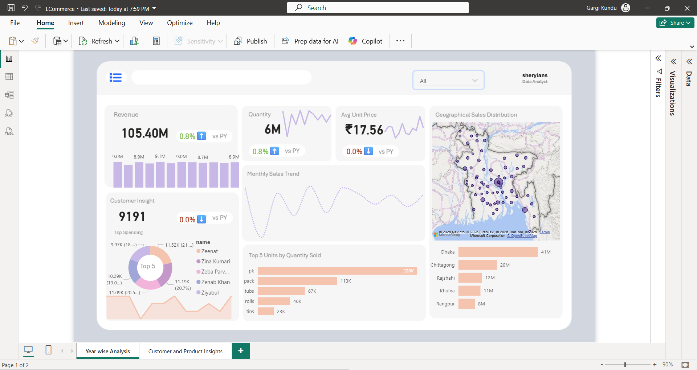

# 🛒 E-Commerce End-to-End Analytics Power BI Project

<p align="center">
  
  
  
</p>

---

## 🌟 Executive Summary
This project delivers a robust business intelligence solution designed to track, analyze, and optimize e-commerce operations. By transforming raw transactional data into actionable insights, this interactive report empowers stakeholders to monitor macro timeline trends, evaluate product performance, and understand customer purchasing behavior to drive revenue growth.

## 🚀 Live Interactive Dashboards & Previews
> 💡 **Recruiter Note:** The project has been fully deployed to the **Power BI Service Cloud Workspace**, featuring both **Static Executive Views** and **Dynamic Ad-hoc Dashboards**.

### 📊 Page 1: Year-Wise Analysis
*Focuses on long-term macro trends, revenue trajectories, and temporal performance spikes.*


### 👥 Page 2: Customer & Product Insights
*Deep-dives into customer demographics, high-value retention metrics, and product category distribution.*


---

## 🏗️ Data Architecture & Modeling (Star Schema)
To ensure optimal query performance, rapid DAX calculation execution, and scalable reporting, the data model was built using a **Star Schema** architecture via the **Manage Relationships** view.
```text
       [customer_dim]        [item_dim]        [store_dim]
             \                   |                  /
              \                  |                 /
               --->        [fact_table]       <---
              /                  |                 \
             /                   |                  \
       [time_dim]           [Trans_dim]        [DAX_MEASURES]
### Data Dictionary & Schema Overview

| Table Name | Table Type | Key Columns / Content | Purpose |
| :--- | :--- | :--- | :--- |
| **`fact_table`** | Fact | `SalesAmount`, `Quantity`, `Order_ID`, Foreign Keys | Stores core transactional metrics and business events. |
| **`customer_dim`** | Dimension | `Customer_ID`, `Customer_Name`, Demographics | Enriches data with customer profile and regional insights. |
| **`item_dim`** | Dimension | `Item_ID`, `Category`, `Price` | Holds product definitions and catalog pricing. |
| **`store_dim`** | Dimension | `Store_ID`, `Store_Name`, `Region` | Maps geographical and store-level performance. |
| **`time_dim`** | Dimension | `Date`, `Year`, `Quarter`, `Month` | Enables advanced **Time Intelligence** calculations. |
| **`Trans_dim`** | Dimension | `Transaction_ID`, `Shipping_Method` | Segment transactional logistics and payment modes. |

---

## ⚡ Advanced DAX Formulas & Analytics
All metrics are organized inside a dedicated `DAX_MEASURES` home table for clean code governance and model maintainability.

### 1️⃣ Total Sales Revenue
TOTAL SALES = SUM(fact_table[total_price])

### 2️⃣ Year-over-Year (YoY) Revenue Growth %
% YOY SALES = 
VAR A = DIVIDE([TOTAL SALES], [PY SALES]) - 1
VAR LABEL = FORMAT(A, "#0.0%")
RETURN LABEL & IF(A > 0, "⬆️", "⬇️")

### 3️⃣ Active Customer Count
ACTIVE CUSTOMERS = DISTINCTCOUNT(customer_dim[coustomer_key])

---

## 🛠️ Technical Competencies Demonstrated
* **Data Modeling:** Star Schema Design, Relationship Cardinality (1:Many), Cross-Filter Direction Optimization.
* **DAX Proficiency:** Time Intelligence functions, Conditional Formatting rules, and Filter Context manipulation (`CALCULATE`).
* **UI/UX Design:** Built cohesive visual layouts following professional design frameworks (consistent grid system, accessible color contrast, intuitive KPI card placements).
* **Power BI Service Deployment:** Workspace management, dashboard creation, app publishing.

---

## 📬 Connect With Me
* **LinkedIn:** [Gargi Kundu](https://www.linkedin.com/in/gargi-kundu)
* **Email:** gargikundu211@gmail.com
